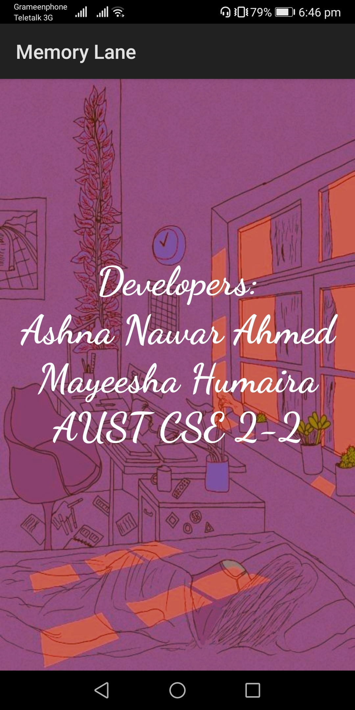

# Memory_Lane
### 2nd year 2nd semester's Android Studio Project 
It was notebook type Android app that could keep notes, set alarm and also do voice recording. Moreover, user could view the saved notes and recordings later on.
Platform: Android, Language: Java

Tasks that can be performed by this app are:
* Welcome page  

* Menu page  

* Note List page  

* Note Taking page  

* Alarm page  

* Alarm clock setting page  

* Recording page  

* Viewing image page  

* Information page  

Demonstration of taking note using this app is given <a href="https://youtu.be/QGMf9znNMKo">Here</a>. 
Demonstration of setting alarm and viewing image using this app is provided <a href="https://youtu.be/BoAYVxsrEUs">Here</a>.

